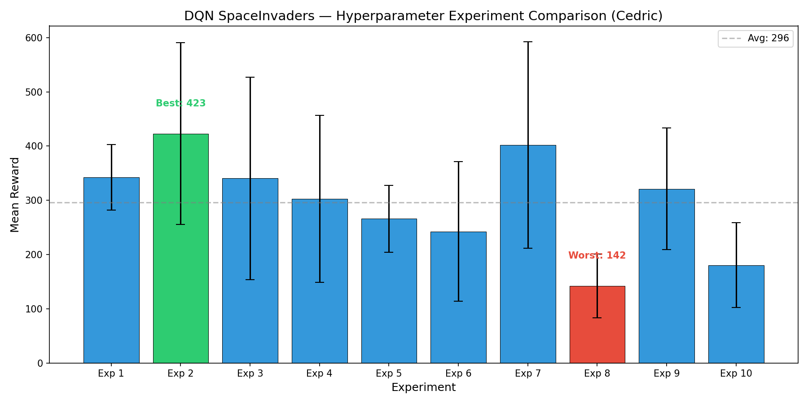
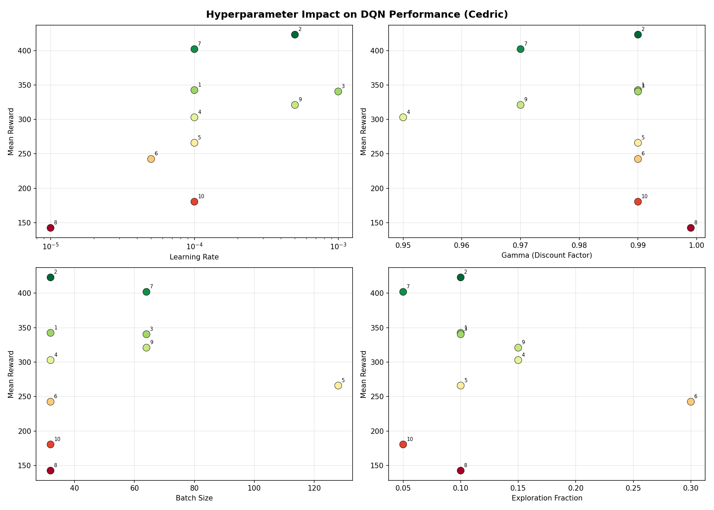

# Deep Q-Network (DQN) Agent for Space Invaders

A Deep Q-Learning agent trained to play Atari Space Invaders using Stable Baselines3 and Gymnasium. This project compares CNN (pixel-based) and MLP (RAM-based) approaches and explores the effect of hyperparameter tuning on agent performance.

## Environment: Space Invaders

We use **ALE/SpaceInvaders-v5** from the Arcade Learning Environment. Space Invaders is a classic fixed-shooter game where the player controls a laser cannon that moves horizontally across the bottom of the screen, firing at descending rows of aliens. It provides a good benchmark for reinforcement learning because it requires the agent to learn spatial awareness, timing, and strategic positioning.

**Observation space:**
- **CNN (CnnPolicy):** 84x84 grayscale frames, stacked 4 frames deep (4x84x84)
- **MLP (MlpPolicy):** 128-byte RAM state vector

**Action space:** 6 discrete actions (NOOP, FIRE, RIGHT, LEFT, RIGHTFIRE, LEFTFIRE)

## Project Structure

```
formative-3-deep-q-learning/
├── train.py                     # Training script (use --member flag)
├── play.py                      # Evaluation/play script
├── requirements.txt             # Dependencies
├── README.md
├── dqn_model.zip                # Group's overall best model (for submission)
├── results/
│   ├── Cedric/
│   │   ├── best_model.zip       # Cedric's best trained model
│   │   ├── experiment_results.json
│   │   ├── models/              # All 10 experiment models (gitignored)
│   │   └── logs/                # TensorBoard logs (gitignored)
│   ├── <MemberB>/               # Another member's results
│   │   ├── best_model.zip
│   │   └── ...
│   └── ...
├── Hyperparameter_Tables/       # CSV results per member
│   └── Cedric_hyperparameter_results.csv
├── assets/                      # Charts for README and presentations
│   ├── Cedric_reward_comparison.png
│   ├── Cedric_lr_impact.png
│   └── Cedric_hyperparameter_analysis.png
├── logs/                        # (gitignored)
└── videos/                      # (gitignored)
```

Each member's work is namespaced under `results/<member>/` so nothing conflicts.

## Setup & Installation

```bash
# Clone the repository
git clone <repo-url>
cd formative-3-deep-q-learning

# Create a virtual environment
python -m venv .venv
source .venv/bin/activate  # On Windows: .venv\Scripts\activate

# Install dependencies
pip install -r requirements.txt

# Install Atari ROMs
AutoROM --accept-license
```

## Training

Every training run requires `--member` to keep results organized.

### Run a single experiment

```bash
python train.py --member Cedric --experiment 1 --lr 1e-4 --gamma 0.99 --batch-size 32 --timesteps 100000
```

### Run with MLP policy

```bash
python train.py --member Cedric --experiment 11 --policy MlpPolicy --lr 5e-4 --gamma 0.99 --batch-size 32 --timesteps 100000
```

This saves everything to `results/Cedric/`:
- Model: `results/Cedric/models/exp1_model.zip`
- Best model: `results/Cedric/best_model.zip`
- Logs: `results/Cedric/logs/exp1/`
- Config: `results/Cedric/logs/exp1/config.json`

### All CLI arguments

| Argument | Default | Description |
|---|---|---|
| `--member` | *(required)* | Your name — namespaces all output under `results/<member>/` |
| `--experiment` | None | Experiment number (1-10) for naming |
| `--lr` | 1e-4 | Learning rate |
| `--gamma` | 0.99 | Discount factor |
| `--batch-size` | 32 | Batch size |
| `--epsilon-start` | 1.0 | Initial exploration rate |
| `--epsilon-end` | 0.05 | Final exploration rate |
| `--epsilon-decay` | 0.1 | Exploration fraction |
| `--policy` | CnnPolicy | CnnPolicy or MlpPolicy |
| `--timesteps` | 500000 | Total training timesteps |
| `--seed` | 42 | Random seed |

### Monitoring with TensorBoard

```bash
tensorboard --logdir results/Cedric/logs/
```

## Playing / Evaluation

### Play with a member's best model

```bash
python play.py --member Cedric
```

### Play with a specific model file

```bash
python play.py --model-path results/Cedric/models/exp2_model.zip
```

### Record video

```bash
python play.py --member Cedric --record --video-dir videos/
```

## Hyperparameter Tuning Experiments

Each team member runs 10 experiments with different hyperparameter configurations. All experiments use CnnPolicy with 100k training steps. Full CSV results are in `Hyperparameter_Tables/`.

---

### Cedric's Experiments

| Exp # | lr | gamma | batch_size | epsilon_start | epsilon_end | epsilon_decay | Noted Behavior | Mean Reward |
|-------|------|-------|------------|---------------|-------------|---------------|----------------|-------------|
| 1 | 1e-4 | 0.99 | 32 | 1.0 | 0.05 | 0.1 | Stable baseline performance; agent learned basic shooting and dodging patterns with consistent rewards | 342.50 +/- 60.71 |
| 2 | 5e-4 | 0.99 | 32 | 1.0 | 0.05 | 0.1 | **Best performer.** Higher lr accelerated learning; agent actively targeted aliens and used cover effectively | 423.00 +/- 167.57 |
| 3 | 1e-3 | 0.99 | 64 | 1.0 | 0.01 | 0.1 | Aggressive lr caused instability (high variance); fast initial learning but inconsistent episode scores | 340.50 +/- 186.47 |
| 4 | 1e-4 | 0.95 | 32 | 1.0 | 0.05 | 0.15 | Lower gamma made agent short-sighted; focused on immediate aliens rather than strategic positioning | 303.00 +/- 153.94 |
| 5 | 1e-4 | 0.99 | 128 | 1.0 | 0.1 | 0.1 | Larger batch smoothed updates but slowed learning; higher epsilon floor kept more random actions | 266.00 +/- 61.76 |
| 6 | 5e-5 | 0.99 | 32 | 1.0 | 0.05 | 0.3 | Very slow learning; long exploration phase (30% of training) meant too much random play before converging | 242.50 +/- 128.67 |
| 7 | 1e-4 | 0.97 | 64 | 1.0 | 0.01 | 0.05 | Quick exploitation transition; slightly reduced gamma still allowed good planning; 2nd best performer | 402.00 +/- 190.06 |
| 8 | 1e-5 | 0.999 | 32 | 1.0 | 0.05 | 0.1 | **Worst performer.** lr too low — barely learned within 100k steps; insufficient weight updates | 142.50 +/- 58.79 |
| 9 | 5e-4 | 0.97 | 64 | 1.0 | 0.1 | 0.15 | Good learning speed from higher lr; balanced but not optimal configuration | 321.00 +/- 112.02 |
| 10 | 1e-4 | 0.99 | 32 | 1.0 | 0.01 | 0.05 | Too-fast exploitation switch; agent committed to greedy policy before learning enough | 180.50 +/- 78.18 |

**Best model:** Experiment 2 (lr=5e-4, gamma=0.99, batch=32) — saved as `results/Cedric/best_model.zip`

**Reward Comparison:**



**Hyperparameter Impact Analysis:**



#### Cedric's Key Insights

- **Learning rate is the most impactful hyperparameter.** lr=5e-4 (Exp 2) hit the sweet spot — fast enough to learn meaningful patterns within 100k steps, but not so aggressive as to destabilize training. lr=1e-5 (Exp 8) was far too slow, while lr=1e-3 (Exp 3) caused high variance.
- **Gamma (discount factor):** gamma=0.99 consistently outperformed lower values. Space Invaders rewards long-term survival (clearing waves), so agents that valued future rewards performed better. gamma=0.95 (Exp 4) made the agent too short-sighted.
- **Exploration fraction matters more than epsilon end.** Exp 10 (decay=0.05) transitioned to greedy play too early and got stuck. Exp 6 (decay=0.3) explored too long and wasted training budget. The 0.1 range was optimal.
- **Batch size:** Smaller batches (32) generally performed better than 128, likely because they allowed more frequent updates within the same training budget.

---

<!-- TEMPLATE FOR OTHER GROUP MEMBERS:
1. Run your 10 experiments:
   python train.py --member YourName --experiment 1 --lr 1e-4 --gamma 0.99 --batch-size 32 --timesteps 100000
   python train.py --member YourName --experiment 2 --lr 5e-4 --gamma 0.99 --batch-size 32 --timesteps 100000
   ... (10 total with different hyperparameter combos)

2. Copy Cedric's section above, replace his name with yours, fill in your results

3. Save your CSV to Hyperparameter_Tables/YourName_hyperparameter_results.csv

4. Play your best model: python play.py --member YourName
-->

## MLP vs CNN Comparison

**CNN (CnnPolicy):**
- Uses raw pixel observations (84x84x4 stacked grayscale frames)
- Learns spatial features through convolutional layers
- Processes visual information similar to how a human would perceive the game

**MLP (MlpPolicy):**
- Uses 128-byte RAM state as input
- Simpler architecture, faster training per step
- RAM contains game state directly (alien positions, bullet locations, score) but in an encoded format the agent must learn to interpret

| Policy | Mean Reward | Training Time (100k steps) | Notes |
|--------|-------------|---------------------------|-------|
| CnnPolicy | **423.00 +/- 167.57** | ~15 min | Best results; learns spatial patterns from pixels effectively |
| MlpPolicy | 162.00 +/- 71.18 | ~8 min | Faster per step but lower performance; RAM encoding is harder to learn |

**Discussion:** CNN significantly outperformed MLP for Space Invaders. While the MLP trains faster per timestep (no convolution overhead), it struggles to extract meaningful features from the raw 128-byte RAM state. The RAM encodes game state in a compact but non-intuitive format — alien positions, player position, bullet states are all packed into bytes that don't naturally decompose into useful features for a simple feedforward network. The CNN, on the other hand, naturally captures spatial relationships (where aliens are relative to the player, bullet trajectories) through its convolutional filters. For visually-driven games like Space Invaders, CNN is the clear winner.

## Gameplay Video

<!-- To record a gameplay video, run: python play.py --member Cedric --record --video-dir videos/ -->
<!-- Then upload the video and link it here, or convert to gif -->

## Team Members

- **Cedric Izabayo** — 10 CNN experiments, best model (Exp 2, reward 423.0), MLP comparison
<!-- Add other group members below -->

## References

- [Stable Baselines3 Documentation](https://stable-baselines3.readthedocs.io/)
- [Gymnasium Atari Environments](https://gymnasium.farama.org/environments/atari/)
- Mnih et al., "Playing Atari with Deep Reinforcement Learning" (2013)
- Mnih et al., "Human-level control through deep reinforcement learning" (2015)
